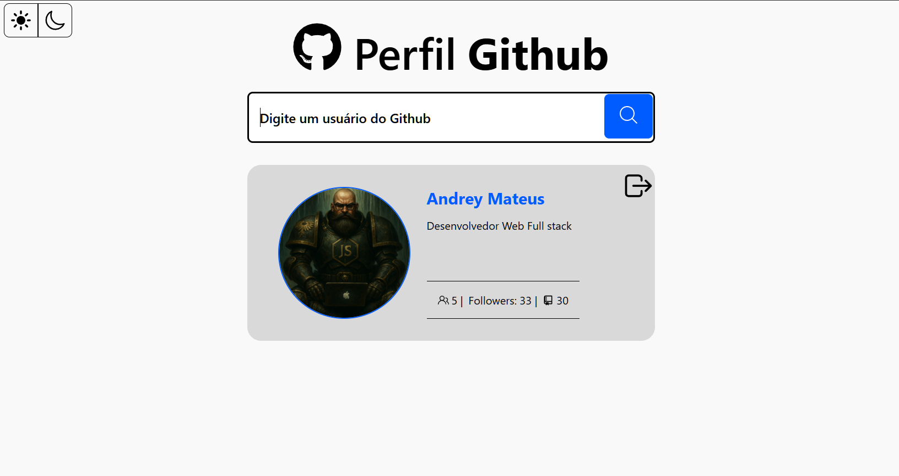

# Github Search Profile

É um projeto que te permite pesquisar sobre usuários do github através de um **username** que um usuário possua no github.

---

### Tecnologias que o Projeto utiliza

 ***React + Typescript + Vite***

---

**API UTILIZADA**

[api.github.com/users/nameuser](https://api.github.com/users/nameuser)

---

### Acessando o Projeto Online: [Clique aqui](https://searchprofileingithub.netlify.app/)

---

Requisitos obrigatórios para rodar o projeto: **Node 18.0+**

---

**Passos para rodar o projeto no seu computador:**

0 - baixe o projeto em seu computador (clone, .rar ou etc)

1 - Entre dentro da pasta do projeto. (via CLI/TERMINAL)

2 - execute um `npm i` ou `npm install`.

3 - execute um `npm run dev`.

4 - Acesse o link do localhost que será gerado via CONSOLE/TERMINAL.

---

### Modos de contraste (Acessibilidade)

### Dark Mode (Modo Escuro)

 É utilizado por padrão

### Light Mode (Modo Claro)

Selecionado através do usuário

---

## Funcionalidades do Projetos

### Procurar usuário

#### Usuário encontrado

##### Através do card de usuário, você pode ver a **foto** de perfil, **número de pessoas que está seguindo**, **número de seguidores**, **número de repositórios (público)**, e um **link** para ir até a página de perfil do github

#### Dark mode (Modo Escuro)

#### Light mode (Modo Claro)

---

### Usuário não encontrado

#### Dark mode (Modo Escuro)

   

#### Light mode (Modo Claro)

---

### Animação de carregamento

#### Dark mode (Modo Escuro)

#### Light mode (Modo Claro)

---

## Créditos

**O Projeto foi baseado no Mockup do link abaixo**

[Clique aqui](https://www.figma.com/proto/DqtFxC6312M32mLt8FpJjq/innovation-class?page-id=22%3A2864&node-id=22-3959&viewport=359%2C115%2C0.25&t=SHsEqEgaMrXGMKwv-1&scaling=scale-down-width&content-scaling=fixed&starting-point-node-id=22%3A3959&show-proto-sidebar=1)
